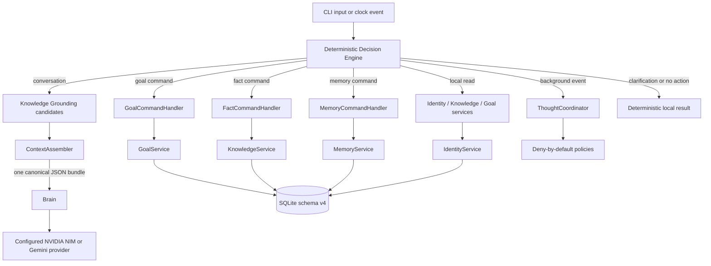

# Nel

**Nel is a local-first persistent personal AI core whose identity, memory, facts, goals, and decisions live outside the language model.**

Status: **v1.0.0** | Interface: Windows development CLI | Tested with Python 3.14.5

Nel is an experimental personal digital companion, not a generic chatbot framework and not a conscious being. Its current interface is a development shell; the long-term product direction is a small physical desktop companion backed by the same platform-independent core.

## Why Nel Is More Than an LLM Wrapper

The model generates language, but it is not Nel's identity or source of authority. Nel keeps durable state in a validated local SQLite database and places deterministic policy boundaries between generated text and permanent data.

- Replacing the provider does not replace identity, facts, goals, or memory.
- Provider output cannot directly create durable facts, goals, identity, or memory.
- User facts and Nel-owned identity use separate namespaces.
- Superseded facts and goals retain recoverable history.
- Every conversational provider request receives one bounded canonical JSON context.
- Explicit local commands are routed before any provider call.

## v1.0.0 Capabilities

- Natural Azerbaijani conversation through configured NVIDIA NIM or Gemini inference.
- Deterministic Decision Engine routing with exactly one primary route per event.
- Persistent immutable core identity with read-only conversation snapshots.
- Versioned user facts with correction, retirement, reactivation, and history.
- Versioned goals with ownership, priority, progress verification, optimistic concurrency, and history.
- Explicit durable memory with deterministic duplicate rejection.
- Provider-proposed fact candidates grounded against exact user-text spans.
- One provider-independent `ContextAssembler` with deterministic relevance and a 12,000-character data ceiling.
- Minimal in-memory Thought System with single-flight execution, cancellation, and no write authority.
- Guarded schema-v4 startup, redacted failure boundaries, validated backup, and isolated restore verification.
- Background thoughts disabled by default.

## Architecture



### Decision Engine

`DecisionEngine` is a pure, provider-independent router. It selects one of conversation, clarification, goal command, fact command, memory command, thought start, or no action before any provider request. It has no repository access and no write authority.

### Identity

Core identity and preference records are separate from user facts. Core records are immutable at the database layer. Conversation receives a bounded read-only snapshot; generated text and user statements cannot mutate identity.

### Facts and Knowledge Grounding

`KnowledgeExtractor` may propose a normalized key, literal value, user subject, confidence, and exact source/value spans. `FactGroundingPolicy` verifies those spans against the original Unicode text and rejects transformed, invented, ambiguous, historical-only, negated, or contradictory candidates. Valid candidates are temporary guidance only. Durable changes require explicit `/fact` commands through `KnowledgeService`.

### Goals

Goals are durable, provider-independent records separate from facts and identity. `GoalService` is the write boundary. Updates require the expected version; completion, progress, reopen, and restore operations enforce explicit approval rules and preserve prior versions.

### Memory

Ordinary conversation is not stored as durable memory. Only explicit `/remember` requests currently write through `MemoryService`. Duplicate detection uses Unicode normalization and a SHA-256 fingerprint comparison against existing events.

### Thoughts

Thoughts are temporary typed observations, never authority. The in-memory coordinator allows one thought at a time, foreground work invalidates background work, and late cancelled results are discarded. Thought policies reject all permanent changes in v1.0. Background generation remains off by default.

### ContextAssembler

Each conversational provider request receives exactly one canonical JSON object containing bounded identity, relevant active facts, relevant goals, relevant preferences, relevant memories, and safe truncation metadata. Serialization is deterministic, records are packed whole, and the provider-data ceiling is 12,000 Unicode characters. Stored values are not appended elsewhere in the prompt.

### Provider Independence

Nel's state and policies do not belong to a model provider. `Brain` accepts an injected provider with text and structured-generation capabilities. Runtime selects NVIDIA NIM or Gemini from explicit configuration without moving conversation state into either SDK. Provider errors never trigger an automatic fallback or provider switch.

## Persistence: SQLite Schema v4

Runtime requires exactly eight `STRICT` tables:

1. `schema_version`
2. `memory_events`
3. `user_facts_current`
4. `user_fact_history`
5. `nel_identity_current`
6. `nel_identity_history`
7. `goals_current`
8. `goals_history`

Schema v4 also requires two canonical immutable-core identity triggers and `goals_current_state_updated_idx`.

Persistence guarantees include explicit transactions, direct current-state records, recoverable fact/identity/goal history, expected-version goal updates, fact retirement without hard deletion, Unicode round trips, strict startup validation, and backup verification through an isolated restore. Runtime never silently creates or migrates a production database.

## Tested Environment

- Windows
- Python **3.14.5**
- SQLite supplied by Python's standard library
- `google-genai==2.13.0`
- `openai==2.52.0`
- `pydantic==2.13.4`
- `python-dotenv==1.2.2`

Other operating systems and Python versions are not release-qualified.

## Installation

```powershell
git clone <repository-url>
cd Nel
py -3.14 -m venv .venv
.\.venv\Scripts\python.exe -m pip install -r requirements.txt
.\.venv\Scripts\python.exe scripts\verify_environment.py
```

The environment verifier checks Python and exact dependency versions without requiring provider credentials.

### Runtime Database Requirement

The full CLI requires an existing validated schema-v4 database. Private runtime databases are not distributed, and v1.0 does not provide a public bootstrap wizard. A fresh clone can install, import, and run the complete test suite, but runtime startup will fail safely until the operator supplies an approved schema-v4 database.

The default path is `memory/nel.sqlite3`. `NEL_DATABASE_PATH` may select another existing database for isolated development.

## Configuration

Create a local `.env` file using placeholders and replace them only on your machine:

```dotenv
NEL_PROVIDER=<nvidia-or-gemini>

# Required when NEL_PROVIDER=nvidia
NVIDIA_API_KEY=<your-nvidia-api-key>
NVIDIA_MODEL=<your-nvidia-model-id>
NVIDIA_BASE_URL=<your-openai-compatible-nim-base-url>

# Required when NEL_PROVIDER=gemini
GEMINI_API_KEY=<your-gemini-api-key>
GEMINI_MODEL=<must-be-gemini-3.5-flash-lite>

# Optional
NVIDIA_TIMEOUT_SECONDS=45
GEMINI_TIMEOUT_SECONDS=45
ENABLE_BACKGROUND_THOUGHTS=false
NEL_DATABASE_PATH=memory/nel.sqlite3
```

`NEL_PROVIDER` accepts `nvidia` or `gemini` and defaults explicitly to `nvidia` when omitted. Gemini defaults to and accepts the stable model ID `gemini-3.5-flash-lite`. Only the selected provider's credentials are required. Never commit `.env`. Configuration is parsed only during guarded runtime construction. Missing or malformed selected-provider settings produce a redacted startup error; importing local modules does not require credentials.

## Start Nel

```powershell
.\.venv\Scripts\python.exe main.py
```

Type `exit` to stop. The CLI owns shutdown and terminates its clock and thought coordinator.

## Commands

All commands below are deterministic local routes and do not require a provider call.

### Memory

```text
/remember TEXT
```

Stores non-empty literal text. Exact normalized duplicates are rejected.

### Facts

```text
/fact list
/fact set FACT_KEY --value "VALUE" --confirm
/fact history FACT_KEY
/fact retire FACT_KEY --confirm --reason "REASON"
```

Setting a retired key reactivates it as a new version. Retirement preserves the internal value and complete history while excluding the retired fact from normal reads and provider context.

### Goals

```text
/goal create --title "TITLE" --success "SUCCESS CONDITION" [--description "TEXT"] [--priority low|normal|high] [--deadline "VALUE"]
/goal list
/goal pause GOAL_ID --version VERSION
/goal resume GOAL_ID --version VERSION
/goal complete GOAL_ID --version VERSION --accept-success
/goal cancel GOAL_ID --version VERSION
/goal reopen GOAL_ID --version VERSION --reason "REASON"
/goal restore GOAL_ID --version VERSION --reason "REASON"
/goal progress GOAL_ID --version VERSION --verification unknown|user_reported|verified [--summary "TEXT"] [--percent 0-100] [--confirm]
```

Accepted progress (`user_reported` or `verified`) requires `--summary` and `--confirm`. `unknown` means no accepted progress evidence exists; it is not zero percent.

## Provider-Free Natural-Language Reads

The deterministic Azerbaijani local-intent layer supports common reads such as:

```text
Sən kimsən?
Mənim haqqımda nə bilirsən?
Məqsədlərim nədir?
Mənim ən sevdiyim oyun hansıdır?
```

These routes read local services without calling the provider. Natural-language aspirations do not create goals; durable goal creation requires `/goal create`.

## Backup

Stop Nel before operational backup work. Create a destination under the ignored backup tree and call the existing service:

```powershell
$stamp = Get-Date -Format 'yyyyMMddTHHmmssZ'
$dir = "backups/sqlite-cutover/release/$stamp"
New-Item -ItemType Directory -Path $dir | Out-Null
$backup = "$dir/nel-schema-v4.sqlite3"

.\.venv\Scripts\python.exe -c "import sys; from src.persistence.backup import backup_sqlite_database; r=backup_sqlite_database(sys.argv[1],sys.argv[2]); print('PASS', r.validation_status, r.destination_path)" memory/nel.sqlite3 $backup
.\.venv\Scripts\python.exe -c "import sys; from src.persistence.backup import verify_sqlite_backup; print('PASS' if verify_sqlite_backup(sys.argv[1]) else 'FAIL')" $backup
```

Backup uses `sqlite3.Connection.backup()`. Validation restores to an isolated temporary location, checks integrity and the complete schema-v4 structure, validates history continuity and Unicode, and compares logical contents during backup creation. Stored values are not printed.

## Restore

1. Stop Nel.
2. Create and validate a fresh backup of the current database.
3. Copy the selected backup to a separate restore-candidate path.
4. Run `verify_sqlite_backup()` on that candidate.
5. Preserve the current database as a timestamped pre-restore file.
6. Publish the verified candidate as `memory/nel.sqlite3`.
7. Start Nel and exit immediately, then verify integrity and the expected hash.

Never SQL down-migrate. After any new write, rollback to an older backup necessarily accepts the loss of writes made after that backup.

`scripts/sqlite_cutover.py` is retired historical JSON-to-schema-v1 tooling. Its CLI refuses execution and must not be used to verify or operate schema v4.

## Tests

The current repository contains **314 assertion-based `unittest` tests**. The
v1.0.0 acceptance baseline contained 300 tests; this post-v1 provider update
adds compatibility coverage. Tests use temporary databases and protect
production data by hash.

```powershell
$env:PYTHONIOENCODING='utf-8'
.\.venv\Scripts\python.exe -m unittest discover -s tests -p 'test*.py' -v
.\.venv\Scripts\python.exe -m compileall -q main.py src scripts tests
git diff --check
```

## Security and Data Integrity

- User data, identity, credentials, and memory remain owner-controlled.
- Secrets are excluded from Git and must not enter prompts or logs unnecessarily.
- Expected provider, configuration, SQLite, context, and background failures cross redacted boundaries.
- Tests use temporary persistence and must not modify real memory.
- Commands route through owning services; repositories are not normal write boundaries.
- Generated responses, extracted candidates, and thoughts have no automatic durability authority.
- Backup success requires structural validation and isolated restore verification, not file existence alone.

Nel is local-first, not local-only: configured cloud inference sends the bounded user message and canonical context required for a provider request.

## Known Limitations

- The CLI is a development shell, not the intended final interface.
- Runtime supports explicit NVIDIA NIM or Gemini selection and has no automatic provider fallback.
- Provider latency and availability vary; failures are graceful but conversation may be unavailable.
- Context relevance is deterministic lexical matching and can miss paraphrases, synonyms, or Azerbaijani morphological variants.
- The 12,000-character context ceiling is not a provider-token guarantee.
- Grounding intentionally rejects ambiguous statements and can produce false negatives.
- Memory duplicate enforcement is lookup-based and concurrent writers can race.
- Background thoughts are disabled by default; thoughts are non-persistent and cannot write state.
- Natural-language goal creation, planning, reminders, scheduling, and external actions are not implemented.
- The source release does not include private runtime data or a public schema bootstrap workflow.

## Roadmap Direction

Already documented post-stable directions include:

- a formal provider capability protocol if additional implementations require it;
- measured retrieval improvements only when lexical relevance proves insufficient;
- longer-running runtime and resource validation;
- controlled preference formation and explicitly permissioned proactive behavior;
- desktop, mobile, voice, vision, and physical companion exploration after core reliability is sustained.

These are directions, not promised dates or implemented capabilities.

## Contributions

Nel is currently a personal project. No formal external contribution or governance process has been established. Material product or architecture changes require owner review before implementation.

## License

No software license has been published for this repository. Do not assume permission to copy, modify, or redistribute the project beyond rights provided by applicable law.

## Disclaimer

Nel is experimental personal AI software. It is artificial, does not claim consciousness or human equivalence, and must not be treated as an authority for high-stakes decisions.
